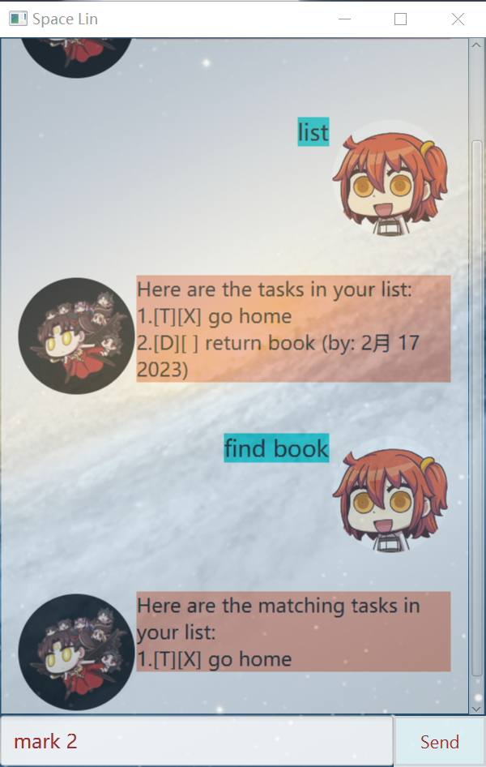

# Space Lin

## Introduction

Space Lin is an individual project built on the Duke project template. It's a personal assistant that can help you to keep track of any task.

## Features 

### Add task

Add a task to the task list. There are three different types of tasks in total. Each type of type can be added using different command.

### Find task

Find a task in the task list according to certain keywords.

### Delete task

Delete a task from the task list according to the task sequence number.

### Mark task

Mark a task as done or not done yet.

### List task

List the tasks that are currently stored in the task list.

## Usage

Action | Format, Examples
--------|------------------
**Todo** | `todo TASK_NAME` <br> e.g., `todo go home`
**Deadline** | `deadline TASK_NAME /by yyyy-MM-dd [HH:mm]` <br> e.g., `deadline go home /by 2023-02-17 18:00`
**Event** | `event TASK_NAME /from yyyy-MM-dd [HH:mm] /to yyyy-MM-dd [HH:mm]` <br> e.g., `event go home /from 2023-02-17 18:00 /to 2023-02-18`
**Delete** | `delete INDEX` <br> e.g., `delete 3`
**Mark** | `mark INDEX`<br> e.g.,`mark 1`
**Unmark** | `unmark INDEX`<br> e.g.,`unmark 2`
**Find** | `find KEYWORD [MORE_KEYWORDS]`<br> e.g., `find go home`
**List** | `list`
**Bye** | `bye`


## Duke project template

This is a project template for a greenfield Java project. It's named after the Java mascot _Duke_. Given below are instructions on how to use it.

## Setting up in Intellij

Prerequisites: JDK 11, update Intellij to the most recent version.

1. Open Intellij (if you are not in the welcome screen, click `File` > `Close Project` to close the existing project first)
1. Open the project into Intellij as follows:
   1. Click `Open`.
   1. Select the project directory, and click `OK`.
   1. If there are any further prompts, accept the defaults.
1. Configure the project to use **JDK 11** (not other versions) as explained in [here](https://www.jetbrains.com/help/idea/sdk.html#set-up-jdk).<br>
   In the same dialog, set the **Project language level** field to the `SDK default` option.
3. After that, locate the `src/main/java/Duke.java` file, right-click it, and choose `Run Duke.main()` (if the code editor is showing compile errors, try restarting the IDE). If the setup is correct, you should see something like the below as the output:
   ```
   Hello from
    ____        _        
   |  _ \ _   _| | _____ 
   | | | | | | | |/ / _ \
   | |_| | |_| |   <  __/
   |____/ \__,_|_|\_\___|
   ```
